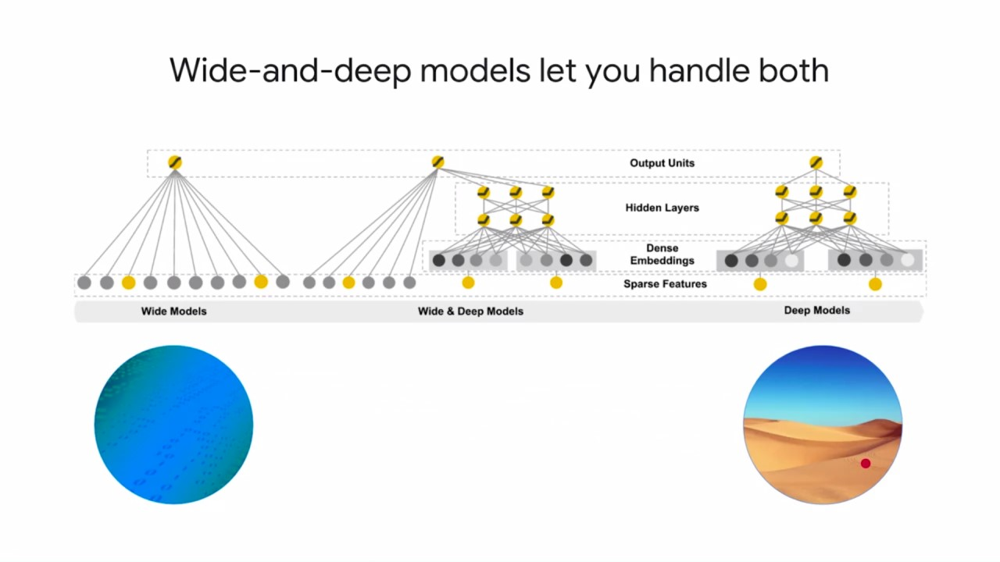

## Explore Data

For each attribute, we care about 2 things
- the number of data distribution of the attribute (x: mother's age, y: # of data)
- the relation of the attribute and the label attribute (x: mother's age, y: baby's weight)

## What makes a feature "good"?

1. Be related to the objective
2. Be known at prediction-time
3. Be numeric with meaningful magnitude
4. Have enough examples
5. Bring human insight to problem

## Creating a dataset

when developing, we often create small dataset sampled from full dataset.
Make sure that the smaller dataset is representative of the full dataset.

## Building the model

### Epoch vs. Iteration

When data is dynamic, number of epoch actualy result in different training length.
If we're retraining or finetuning the model periodically, iteration would make more sense.

### Wide vs. Deep

- Wide(linear) models are good at sparse features(e.g. categorical features)
- Deep models are good at dense and highly-correlated features

By combining the strong suits of the wide model and the deep model, we can  - connect the sparse inputs to the output like a linear regressor
- connect the dense inputs to a multiple layer model

Linear models help memorize the input space and are appropriate when you want to essentially train separate linearly independent models for different values of a categorical variable.

Deep learning models help to decorrelate the inputs and generalized better by capturing the relationship between dense inputs and the label.

## Apache Beam Input pipeline

use apache beam, you can easily adapt your input pipeline to different data source (batch/streamin).

## hash

It's quite useful to add a column with hash value to the data.  
Because while predicting, we're usually batch predicting through a lot of machines. Having a hashed column will make it easy to determine which data you're predicting.

## Code

We'll need the tensorflow code to be packed up as a python package.
Usually we'll have at least 2 files.
- task.py
  contain the code to parse command-line arguments. Any part of our code that's configurable, or whose value is known only at runtime, we will make it a command-line argument.
- model.py
  the one with all of our TensorFlow code, including the train and evaluate loop

## training monitoring

- loss converges
- evaluation metric doesn't go back up
- layers don't die as demonstrated by the fraction of zero values.