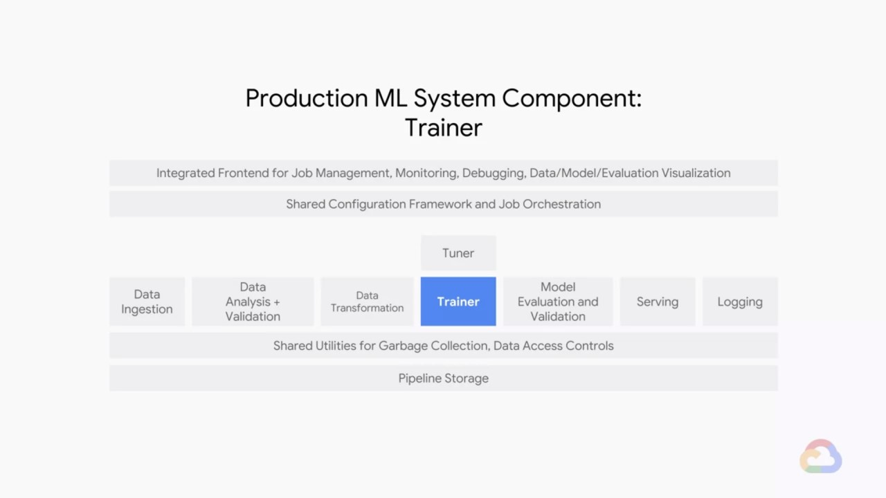
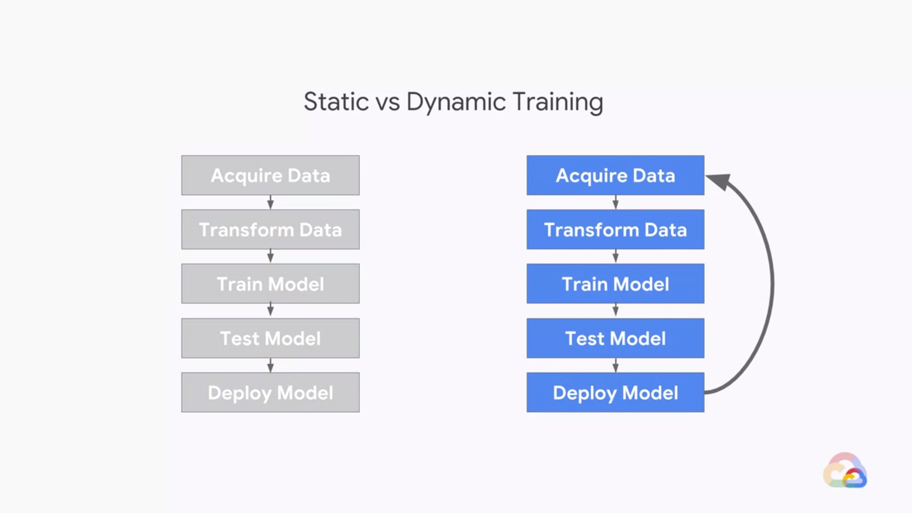
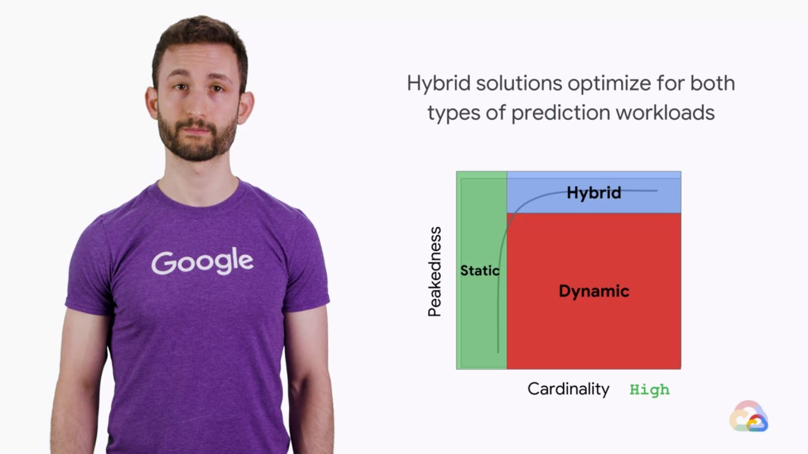
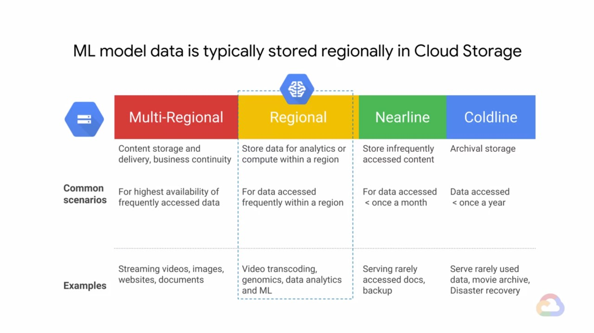
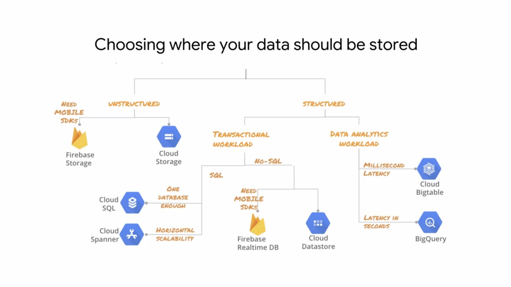
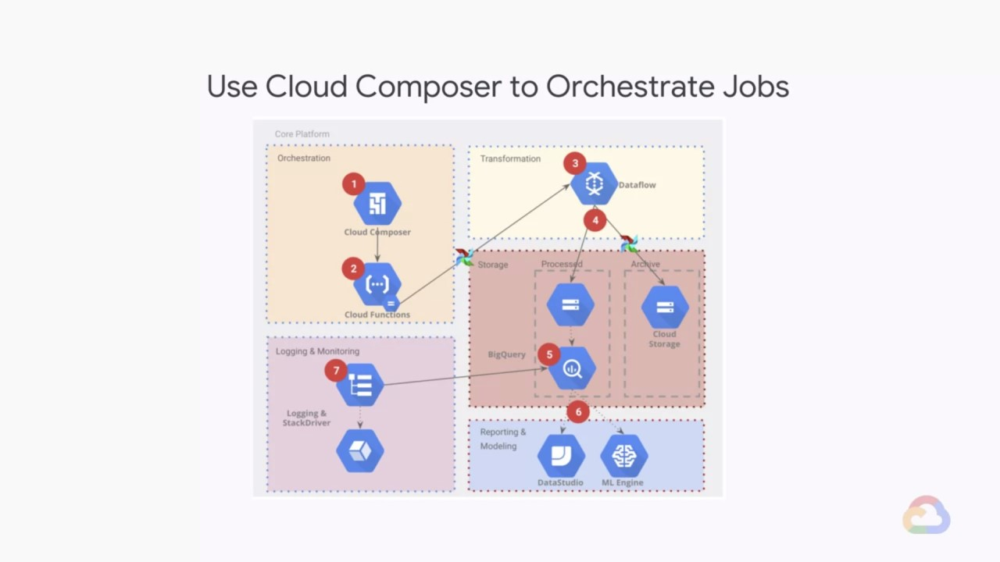

# Production Machine Learning Systems
course link: https://www.coursera.org/learn/gcp-production-ml-systems  

- [Production Machine Learning Systems](#production-machine-learning-systems)
  - [The Components of an ML System](#the-components-of-an-ml-system)
  - [Training Design Decisions](#training-design-decisions)
    - [How is Physics unlike Fashion ?](#how-is-physics-unlike-fashion-)
    - [Static vs Dynamic Training](#static-vs-dynamic-training)
  - [Serving Design Decisions](#serving-design-decisions)
    - [Static vs Dynamic Serving](#static-vs-dynamic-serving)
    - [Peakedness and Cardinality](#peakedness-and-cardinality)
  - [Data Ingestion](#data-ingestion)
    - [Data Scenarios](#data-scenarios)
    - [Different Types of GCP Buckets](#different-types-of-gcp-buckets)
    - [Different Service for Different Databases](#different-service-for-different-databases)
    - [Automatic ETL Pipelines into GCP](#automatic-etl-pipelines-into-gcp)

---

## The Components of an ML System

- Data Analysis + Validation  
  monitor the data distribution 
- Trainer  
  support for both data and model parallelism
- Tuner  
  there are no globally optimal values for hyperparameters, only problem-specific optima
- Serving  
  - **low-latency** to respond to users quickly
  - **highly efficient** so that many instances can be run simultaneously
  - **scale horizontally** to be reliable and robust to failures
  - **easy to update** to new versions of the model 

---

## Training Design Decisions

### How is Physics unlike Fashion ?
Physics is constant whereas fashion isn't.  
You have to decide whether the phenomenon you're modelling is more like physics or like fashion.

### Static vs Dynamic Training

| Statistically Trained Model |                   Dynamically Trained Model                    |
| :-------------------------: | :------------------------------------------------------------: |
|    Trained once, offline    |                  Add training data over time                   |
|   Easy to build and test    | Engineering is harder  Have to do progressive validation  |
|  Easy to let become stable  | Regularly sync out updated version  Will adapt to changes |

---

## Serving Design Decisions

### Static vs Dynamic Serving

|              |     Static      |      Dynamic      |
| :----------- | :-------------: | :---------------: |
| Storage Cost |     higher      |       lower       |
|      Latency |   low, fixed    |     variable      |
|  Maintenance |      lower      |      higher       |
|    Resources | space intensive | compute intensive |

### Peakedness and Cardinality

Regarding the serving input,

- **Peakedness** is how concentrated the distribution is.  
- **Cardinality** is the number of values in the set.

Based on the peakedness and the cardinality, we decide which design to use.

---

## Data Ingestion

### Data Scenarios
- Use local network to upload local data
- Use storage devices to transfer data offline  
  When the network is the bottleneck (e.g., the data is too big, the network is too slow).
- Cloud2Cloud
- Transfer from existing database

### Different Types of GCP Buckets

### Different Service for Different Databases

### Automatic ETL Pipelines into GCP

Depends on how the ETL pipeline is invoked, there are
- Push model  
  load data on demand, best for ad hoc or envent-based loading.

- Pull model  
  schedule the data loading periodically, better for when there are a repeatable process and scheduled interval.