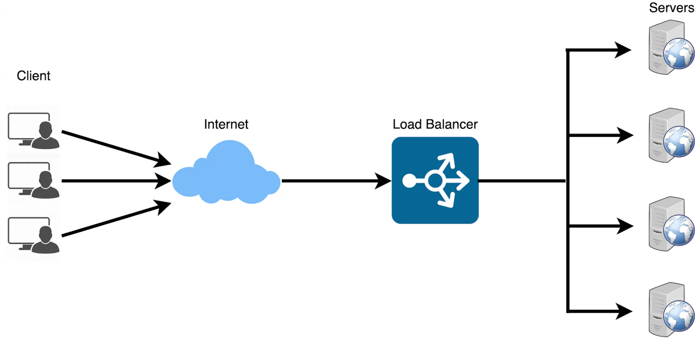
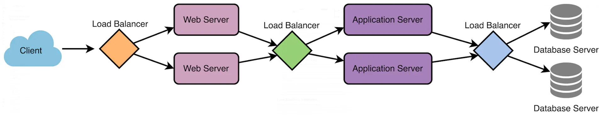
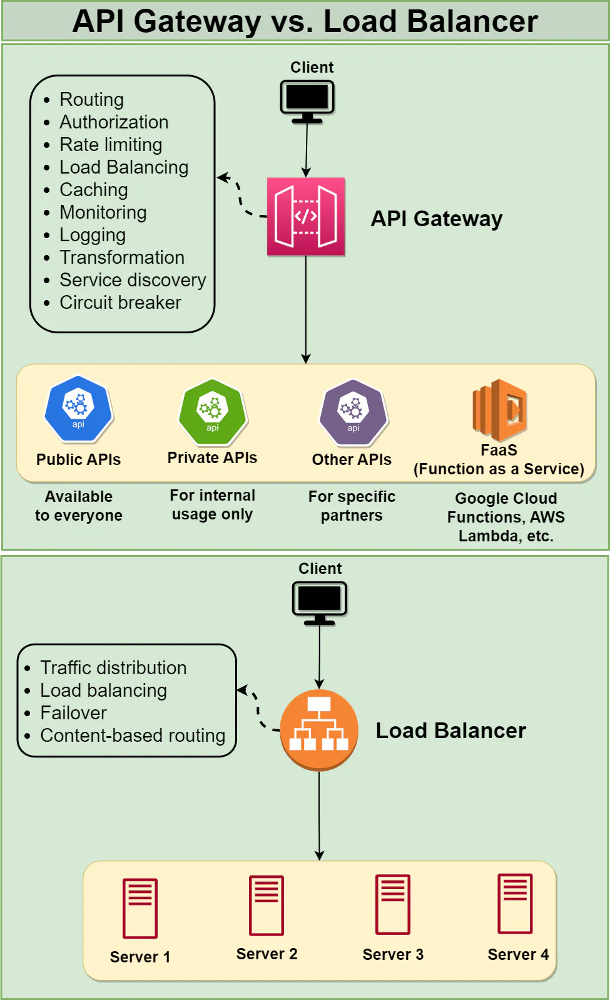

# Grokking System Design Fundamentals
https://www.designgurus.io/course/grokking-system-design-fundamentals

## Load Balancing
Typically a load balancer sits between the client and the server accepting incoming network and application traffic and distributing the traffic across multiple backend servers using various algorithms. By balancing application requests across multiple servers, a load balancer reduces the load on individual servers and prevents any one server from becoming a single point of failure, thus improving overall application availability and responsiveness.

### Key terminology and concepts
- Session Persistence:  
    A technique used to ensure that subsequent requests from the same client are directed to the same backend server, maintaining session state and providing a consistent user experience.

- SSL/TLS Termination:  
    The process of decrypting SSL/TLS-encrypted traffic at the load balancer level, offloading the decryption burden from backend servers and allowing for centralized SSL/TLS management.

### Load Balancing Algorithms
- Round Robin
  - pros
    - Easy to implement
    - Works well when servers have similar capacities
  - cons
    - Round Robin is predictable in its request distribution pattern, which could potentially be exploited by attackers who can observe traffic patterns and might find vulnerabilities in specific servers by predicting which server will handle their requests.
- Least Connections/ResponseTime/Bandwith
  - pros
    - it's more effective when 
      - dealing with requests that take a variable amount of time to process
      - server has different capacities
  - cons
    - Requires tracking the stats for each server, which can increase complexity
- weighted Round Robin/Least Connections
  - pros
    - Adapts to varying server workloads and capacities.
  - cons
    - Weights must be assigned and maintained manually.
- IP Hash
  - pros
    - Maintains session persistence, which can be useful for applications requiring a continuous connection with a specific server.
  - cons
    - May not balance load effectively when dealing with a small number of clients with many requests.
- Custom Load
  - pros
    - Highly customizable, allowing for tailored load balancing to suit specific use cases.
    - Can consider multiple factors, including server health, response times, and capacity while the above mentioned methods may not consider.
  - cons
    - Requires custom development and maintenance, which can be time-consuming and complex.
    - May require extensive testing to ensure optimal performance.

### Load Balancer Types
- Hardware Load Balancing
  - fast but expensive
- Software Load Balancing
  - flexible but consume host resources
- Cloud-based Load Balancing
  - easy to scale
- DNS Load Balancing
  - Can distribute traffic across geographically distributed servers
- Layer 4 Load Balancing
  - based on IP
- Layer 7 Load Balancing
  - based on applicaion

### Stateless vs. Stateful Load Balancing
- Stateless
  - load balancer does not store session information
- Stateful
  - Source IP Affinity
  - Session Affinity

Stateless load balancing is useful for applications capable of processing requests independently, while stateful load balancing is more appropriate for applications that depend on session data.

### Scalability and Performance
#### Horizontal and vertical scaling of load balancers
- Horizontal scaling
  - This involves adding more load balancer instances to distribute traffic among them.
  - Horizontal scaling can be achieved using **DNS load balancing** or by implementing an additional load balancer layer to distribute traffic among the instances.
- Vertical scaling
  - This involves increasing the resources (e.g., CPU, memory, and network capacity) of the existing load balancer instances.
#### Connection and request rate limits
Load balancers can enforce rate limits based on various criteria, such as IP addresses, client domains, or URL patterns. Implementing these limits can also help mitigate the impact of Denial of Service (DoS) attacks and prevent individual clients from monopolizing resources.
#### Caching and content optimization
Load balancers can cache static content, such as images, CSS, and JavaScript files, to reduce the load on backend servers and improve response times.
#### Impact of load balancers on latency
Introducing a load balancer into the request-response path adds an additional network hop, which can result in increased latency. (Though the impact is typically minimal)
Optimizing the performance of the load balancer can be achieved through various strategies, including:
- Geographical distribution
- Connection reuse

### Challenges of Load Balancers
Here are the challenges and remedies.

- Single Point of Failure
  - Implement high availability and failover mechanisms, such as redundant load balancer instances.
- Scalability Limitations
  - Plan for horizontal or vertical scaling of the load balancer to match traffic demands, and use scalable cloud-based load balancing solutions.
- Latency
  - Optimize load balancer performance through efficient routing algorithms and by placing the load balancer geographically close to the majority of users.
- Sticky Sessions
  - Employ advanced load balancing techniques that balance the need for session persistence with even traffic distribution, or redesign the application to reduce dependence on session state.
- Health Checks and Monitoring
  - Implement comprehensive and regular health checks for backend servers, and use real-time monitoring tools to ensure traffic is always directed to healthy instances

## API gateway
### Introduction to API Gateway
Its main purpose is to provide a single entry point for external consumers to access the services and functionalities of the backend system. It receives client requests, forwards them to the appropriate microservice, and then returns the server’s response to the client.

The API gateway is responsible for tasks such as routing, authentication, and rate limiting. This enables microservices to focus on their individual tasks and improves the overall performance and scalability of the system.

#### Difference between an API gateway and a load balancer
An API gateway is focused on routing requests to the appropriate microservice, while a load balancer is focused on distributing requests evenly across a group of backend servers.

### Usage of API gateway
As a entry point of a backend system,  
**Inward**:
- Routing
  - route the clients to appropriate service
- Load balancing
- Monitoring  
  
**outward-security**:
- Rate limiting / throttling
- Authentication / Authorization
- Web Application Firewall (WAF)
    
**outward-early-response**:
- Caching
- Circuit breaker
  
**outward-post-processing**:
- Transform response
- Request and response validation
- Monitoring

**outward-version-control**:
- API Versioning
  - The API Gateway can manage multiple versions of an API, allowing developers
  to introduce new features or make changes to existing ones without disrupting existing clients.
- API Documentation

### Advantages and disadvantages of using API gateway
- Advantages 
  - Simplified system design
    - The API Gateway provides a single entry point for all API requests, making it easier to manage, monitor, and maintain APIs across multiple backend services. This simplifies the development and deployment process and reduces the complexity of the overall system.
  - Enhanced security
  - API Versioning and Backward Compatibility
    - The API Gateway can manage multiple versions of an API, allowing developers to introduce new features or make changes without breaking existing clients. This enables a smoother transition for clients and reduces the risk of service disruptions.
- Disadvantages
  - Single Point of Failure

## Key Characteristics of Distributed Systems
Plz read [Key Characteristics of Distributed Systems](./Key%20Characteristics%20of%20Distributed%20Systems.md).