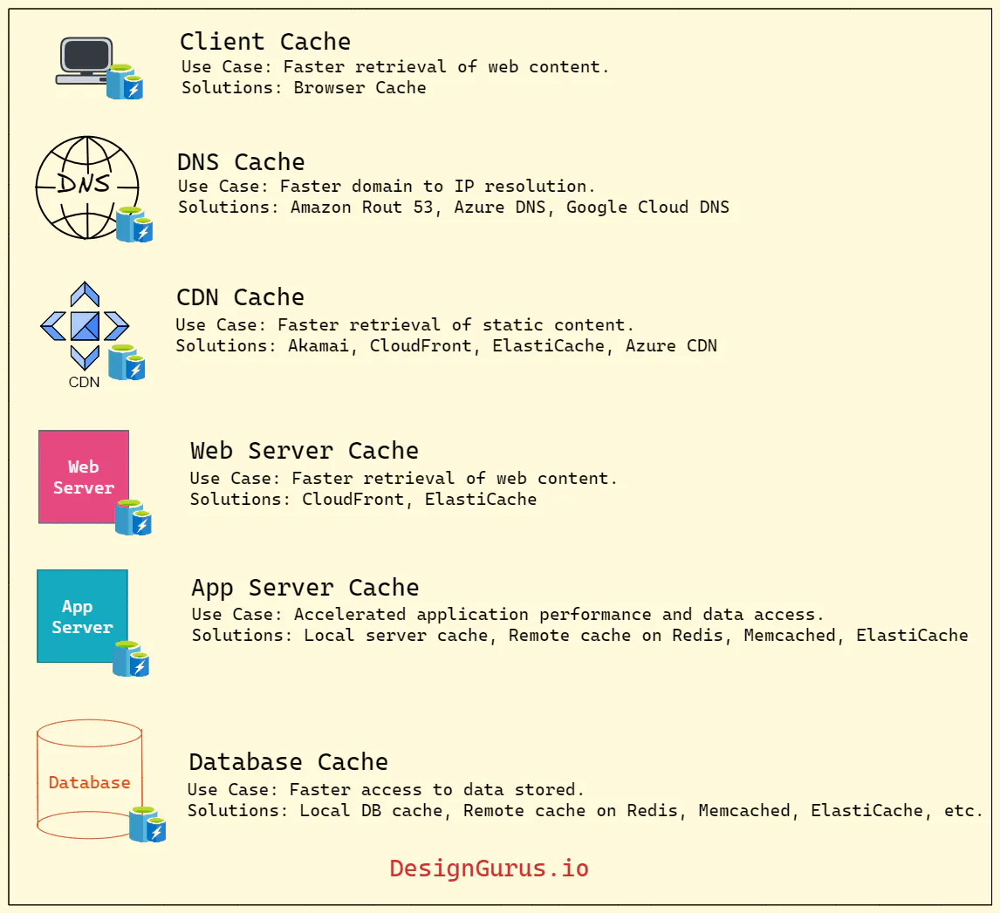
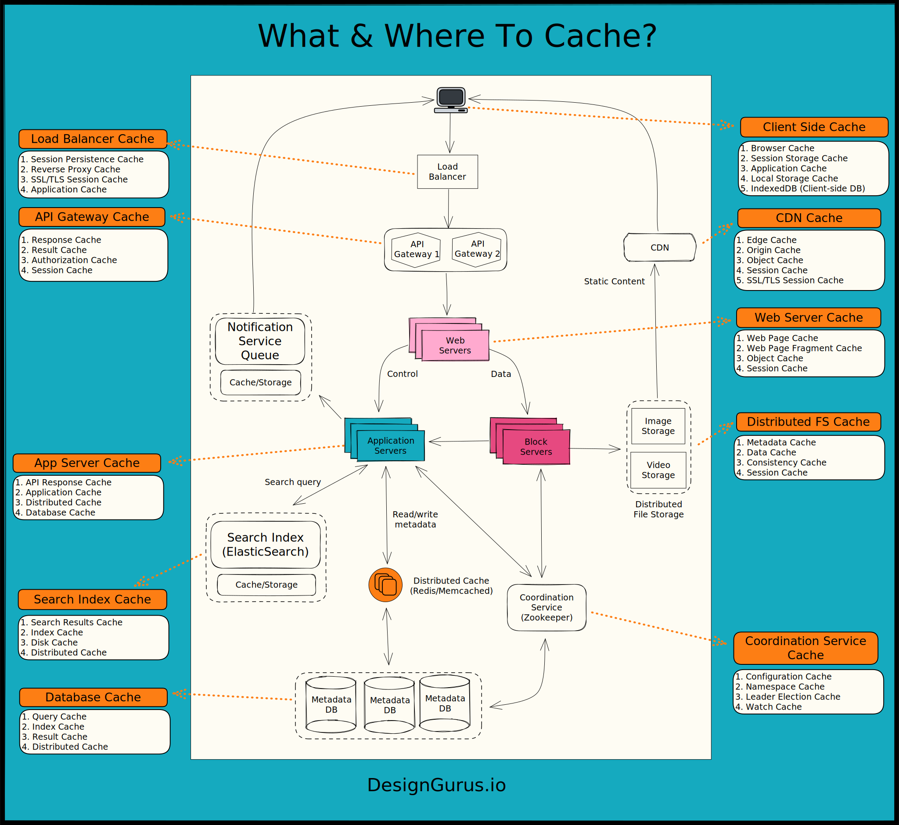
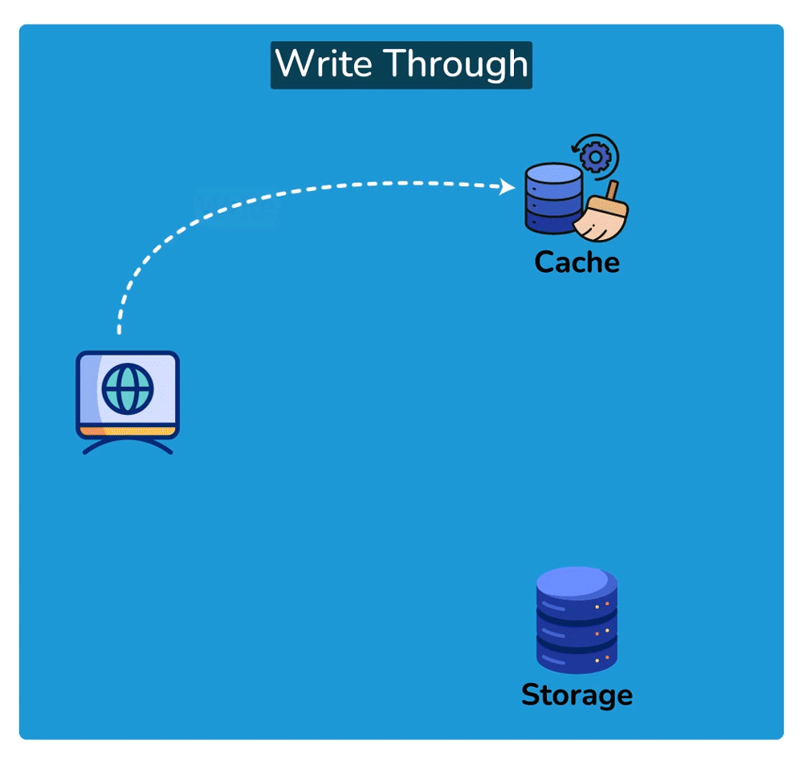
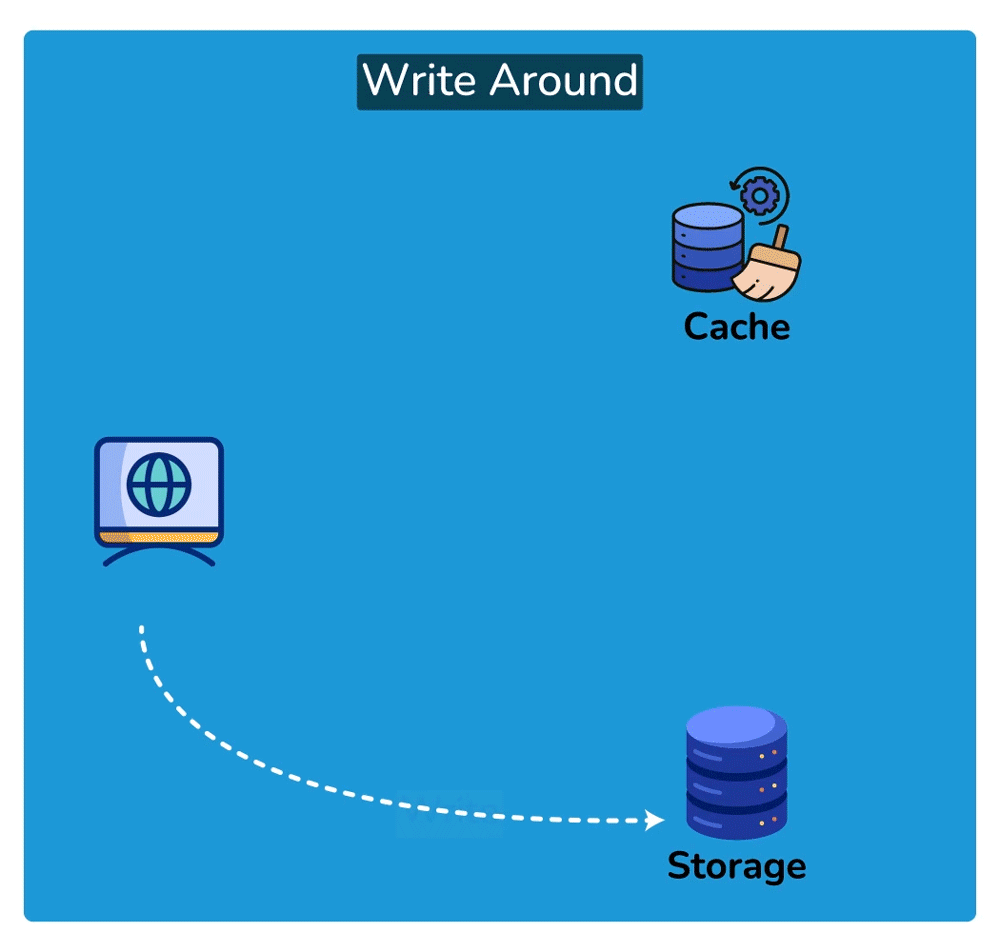
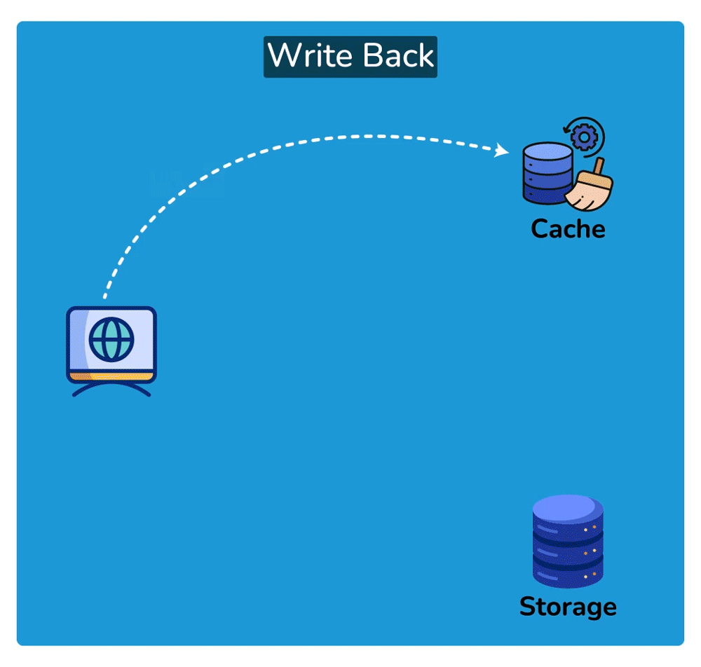
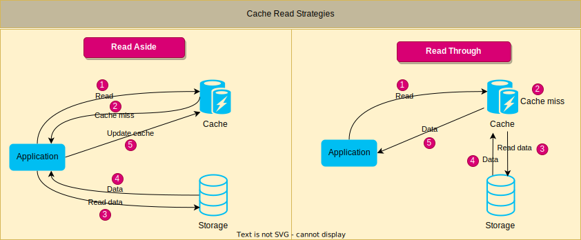

# Grokking System Design Fundamentals
https://www.designgurus.io/course/grokking-system-design-fundamentals

## Load Balancing
Typically a load balancer sits between the client and the server accepting incoming network and application traffic and distributing the traffic across multiple backend servers using various algorithms. By balancing application requests across multiple servers, a load balancer reduces the load on individual servers and prevents any one server from becoming a single point of failure, thus improving overall application availability and responsiveness.

### Key terminology and concepts
- Session Persistence:  
    A technique used to ensure that subsequent requests from the same client are directed to the same backend server, maintaining session state and providing a consistent user experience.

- SSL/TLS Termination:  
    The process of decrypting SSL/TLS-encrypted traffic at the load balancer level, offloading the decryption burden from backend servers and allowing for centralized SSL/TLS management.

### Load Balancing Algorithms
- Round Robin
  - pros
    - Easy to implement
    - Works well when servers have similar capacities
  - cons
    - Round Robin is predictable in its request distribution pattern, which could potentially be exploited by attackers who can observe traffic patterns and might find vulnerabilities in specific servers by predicting which server will handle their requests.
- Least Connections/ResponseTime/Bandwith
  - pros
    - it's more effective when 
      - dealing with requests that take a variable amount of time to process
      - server has different capacities
  - cons
    - Requires tracking the stats for each server, which can increase complexity
- weighted Round Robin/Least Connections
  - pros
    - Adapts to varying server workloads and capacities.
  - cons
    - Weights must be assigned and maintained manually.
- IP Hash
  - pros
    - Maintains session persistence, which can be useful for applications requiring a continuous connection with a specific server.
  - cons
    - May not balance load effectively when dealing with a small number of clients with many requests.
- Custom Load
  - pros
    - Highly customizable, allowing for tailored load balancing to suit specific use cases.
    - Can consider multiple factors, including server health, response times, and capacity while the above mentioned methods may not consider.
  - cons
    - Requires custom development and maintenance, which can be time-consuming and complex.
    - May require extensive testing to ensure optimal performance.

### Load Balancer Types
- Hardware Load Balancing
  - fast but expensive
- Software Load Balancing
  - flexible but consume host resources
- Cloud-based Load Balancing
  - easy to scale
- DNS Load Balancing
  - Can distribute traffic across geographically distributed servers
- Layer 4 Load Balancing
  - based on IP
- Layer 7 Load Balancing
  - based on applicaion

### Stateless vs. Stateful Load Balancing
- Stateless
  - load balancer does not store session information
- Stateful
  - Source IP Affinity
  - Session Affinity

Stateless load balancing is useful for applications capable of processing requests independently, while stateful load balancing is more appropriate for applications that depend on session data.

### Scalability and Performance
#### Horizontal and vertical scaling of load balancers
- Horizontal scaling
  - This involves adding more load balancer instances to distribute traffic among them.
  - Horizontal scaling can be achieved using **DNS load balancing** or by implementing an additional load balancer layer to distribute traffic among the instances.
- Vertical scaling
  - This involves increasing the resources (e.g., CPU, memory, and network capacity) of the existing load balancer instances.
#### Connection and request rate limits
Load balancers can enforce rate limits based on various criteria, such as IP addresses, client domains, or URL patterns. Implementing these limits can also help mitigate the impact of Denial of Service (DoS) attacks and prevent individual clients from monopolizing resources.
#### Caching and content optimization
Load balancers can cache static content, such as images, CSS, and JavaScript files, to reduce the load on backend servers and improve response times.
#### Impact of load balancers on latency
Introducing a load balancer into the request-response path adds an additional network hop, which can result in increased latency. (Though the impact is typically minimal)
Optimizing the performance of the load balancer can be achieved through various strategies, including:
- Geographical distribution
- Connection reuse

### Challenges of Load Balancers
Here are the challenges and remedies.

- Single Point of Failure
  - Implement high availability and failover mechanisms, such as redundant load balancer instances.
- Scalability Limitations
  - Plan for horizontal or vertical scaling of the load balancer to match traffic demands, and use scalable cloud-based load balancing solutions.
- Latency
  - Optimize load balancer performance through efficient routing algorithms and by placing the load balancer geographically close to the majority of users.
- Sticky Sessions
  - Employ advanced load balancing techniques that balance the need for session persistence with even traffic distribution, or redesign the application to reduce dependence on session state.
- Health Checks and Monitoring
  - Implement comprehensive and regular health checks for backend servers, and use real-time monitoring tools to ensure traffic is always directed to healthy instances

## API gateway
### Introduction to API Gateway
Its main purpose is to provide a single entry point for external consumers to access the services and functionalities of the backend system. It receives client requests, forwards them to the appropriate microservice, and then returns the server’s response to the client.

The API gateway is responsible for tasks such as routing, authentication, and rate limiting. This enables microservices to focus on their individual tasks and improves the overall performance and scalability of the system.

#### Difference between an API gateway and a load balancer
An API gateway is focused on routing requests to the appropriate microservice, while a load balancer is focused on distributing requests evenly across a group of backend servers.

### Usage of API gateway
As a entry point of a backend system,  
**Inward**:
- Routing
  - route the clients to appropriate service
- Load balancing
- Monitoring  
  
**outward-security**:
- Rate limiting / throttling
- Authentication / Authorization
- Web Application Firewall (WAF)
    
**outward-early-response**:
- Caching
- Circuit breaker
  
**outward-post-processing**:
- Transform response
- Request and response validation
- Monitoring

**outward-version-control**:
- API Versioning
  - The API Gateway can manage multiple versions of an API, allowing developers
  to introduce new features or make changes to existing ones without disrupting existing clients.
- API Documentation

### Advantages and disadvantages of using API gateway
- Advantages 
  - Simplified system design
    - The API Gateway provides a single entry point for all API requests, making it easier to manage, monitor, and maintain APIs across multiple backend services. This simplifies the development and deployment process and reduces the complexity of the overall system.
  - Enhanced security
  - API Versioning and Backward Compatibility
    - The API Gateway can manage multiple versions of an API, allowing developers to introduce new features or make changes without breaking existing clients. This enables a smoother transition for clients and reduces the risk of service disruptions.
- Disadvantages
  - Single Point of Failure

## Key Characteristics of Distributed Systems
Plz read [Key Characteristics of Distributed Systems](./Key%20Characteristics%20of%20Distributed%20Systems.md).

## Caching
### Types of Caching

- In-memory caching  
  In-memory caching is useful for frequently accessed data that can fit into the available memory. This type of caching is commonly used for caching API responses, session data, and web page fragments.
- Disk caching  
  Disk caching stores data on the hard disk, which is slower than main memory but faster than retrieving data from a remote source. Disk caching is useful for data that is too large to fit in memory or for data that needs to persist between application restarts. This type of caching is commonly used for caching database queries and file system data.
- Database caching  
  Database caching stores frequently accessed data in the database itself, reducing the need to access external storage. This type of caching is useful for data that is stored in a database and frequently accessed by multiple users.
- Client-side caching  
  This type of caching occurs on the client device, such as a web browser or mobile app. Client-side caching stores frequently accessed data, such as images, CSS, or JavaScript files, to reduce the need for repeated requests to the server. Examples of client-side caching include browser caching and local storage.
- Server-side caching  
  This type of caching occurs on the server, typically in web applications or other backend systems. Server-side caching can be used to store frequently accessed data, precomputed results, or intermediate processing results to improve the performance of the server. Examples of server-side caching include full-page caching, fragment caching, and object caching.
- CDN caching  
  CDN caching stores data on a distributed network of servers, reducing the latency of accessing data from remote locations. This type of caching is useful for data that is accessed from multiple locations around the world, such as images, videos, and other static assets. CDN caching is commonly used for content delivery networks and large-scale web applications.
- DNS caching

### Cache replacement policies
When cache become full, we'll need to decide which item in cache should be removed.  

- Least Recently Used (LRU)
- Least Frequently Used (LFU)
- First In, First Out (FIFO)
- Random Replacement

It's basically a trade-off between "effectiveness" and "easy-implementation".  
LRU and LFU are generally more effective than FIFO and random replacement since they take into account the access pattern of the cache. However, LRU and LFU can be more expensive to implement since they require maintaining additional data structures to track access patterns.

### Cache Invalidation
When cached data gets stale or inaccurate, cache invalidation is the process of removing or updating it.

#### Write 
Write involves updating the data, so it's definitely a part of cache invalidation method.  
And how you write also affect how you read.
- write through
  - **disadvantage**: high latency during write operation
  - fast retrieval
  - data consistency is completed once the data gets written, don't need to worry about how to read
  
- write around
  - reduce the cache being flooded with write operations that will not subsequently be re-read
  - **disadvantage**: a read request for recently written data will create a “cache miss” and must be read from slower back-end storage and experience higher latency.
  
- write back
  - write to the permanent storage is done based on certain conditions, for example, when the system needs some free space
  - low-latency and high-throughput for write-intensive applications
  - **disadvantage**: the risk of data loss in case of a crash or other adverse event because the only copy of the written data is in the cache
  
- write behind
  - similar to write-back cache
  - In write-back caching, data is only written to the permanent storage when it is necessary for the cache to free up space, while in write-behind caching, data is written to the permanent storage at specified intervals.

#### Cache Invalidation Method
- Purge, Ban  
  clear cache given specific url or items that met certain conditions
- Refresh  
  Even if there is cached content available, fetches the requested content from the origin server.
- **Time-to-live (TTL) expiration**  
  With this technique, cached content is given a time limit after which it becomes stale and needs to be refreshed. The cache checks the time-to-live value when a request for the content is made and only serves the cached content if the value is still valid. The cache gets the most recent copy of the content from the origin server and caches it if the value has expired.
- **Stale-while-revalidate Cache Invalidation**  
  When someone requests a piece of content, the cached copy is delivered right away, and an asynchronous request is sent to the origin server to get the most recent copy.

#### Cache Read
- read through  
  - cache is responsible for retrieving the data from the underlying data store when a cache miss occurs
  - simplifies the application code
  - improve performance in scenarios where data retrieval from the data store is expensive, and cache misses are relatively infrequent
- read aside(lazy-loading)  
  - application is responsible for retrieving the data from the underlying data store when a cache miss occurs
  - better control over the caching process
  - **disadvantage**: adds complexity to the application code
  - This approach can be beneficial in scenarios where cache misses are relatively infrequent, and the application wants to optimize cache usage based on specific data access patterns
  

#### Reference
https://www.geeksforgeeks.org/cache-invalidation-and-the-methods-to-invalidate-cache/

### Cache Coherence and Consistency Models
#### Cache Coherence
- Write-invalidate  
  write, and notify others to invalidate their cache
- Write-update (or write-broadcast)  
  write, and update others' cache
#### Cache Consistency Models
- Strict Consistency
  - considerable synchronization needed and may not be practical in many distributed systems
- Sequential Consistency
  - considerable synchronization needed and may not be practical in many distributed systems
- Causal Consistency
  - operations that are causally related (i.e., one operation depends on the outcome of another) are guaranteed to appear in order across all caches.
- Eventual Consistency
  - all updates to a data item will eventually propagate to all caches, but there is no guarantee about the order or timing of the updates
  - best performance yet weakest consistency
  - often used in distributed systems where performance and scalability are prioritized over strict data accuracy

### Caching Challenges
#### Thundering Herd
The thundering herd problem occurs when a popular piece of data expires from the cache, leading to a sudden surge in requests to the origin server to fetch the missing data.

Solution:  
staggered expiration times, implementing a cache lock, or using background updates to refresh the cache before the data expires

#### Cache Penetration
Cache penetration refers to the situation where requests for data bypass the cache and directly access the origin server, reducing the benefits of caching. This typically happens when requests are made for non-existent or rarely accessed data.

To mitigate:  
using a bloom filter to check for the existence of data before querying the cache can be employed

#### Big Key
a large piece of data that consumes a significant portion of the cache's capacity

Solution:  
compressing the data before caching

#### Hot Key
A hot key refers to a piece of data that is frequently accessed, causing contention and performance issues in the caching system. Hot keys can lead to cache thrashing and an unbalanced distribution of load.

Solutions:  
using consistent hashing to distribute the load more evenly, replicating the hot key across multiple cache nodes, or implementing a load balancing strategy to distribute requests across multiple instances of the hot key.

#### Cache Stampede (or Dogpile)
Cache stampede occurs when multiple requests for the same data are made simultaneously, causing excessive load on the cache and the origin server

Solutions:  
request coalescing (combining multiple requests for the same data into a single request) or implementing a read-through cache, where the cache itself fetches the missing data from the origin server

#### Cache Pollution
Cache pollution occurs when less frequently accessed data displaces more frequently accessed data in the cache, leading to a reduced cache hit rate

Solutions:  
eviction policies like LRU (Least Recently Used) or LFU (Least Frequently Used) can be employed, which prioritize retaining frequently accessed data in the cache.

#### Cache Drift
Cache drift refers to the inconsistency between cached data and the data on the origin server.
To handle cache drift, proper cache invalidation strategies should be implemented to ensure that the cache is updated or invalidated when the data on the origin server changes.

### Cache Performance Metrics
- Hit rate, Miss Rate  
- Cache size  
  A larger cache size can result in a higher hit rate, but it may also increase the cost and complexity of the caching solution.
- **Cache latency**  
  The cache latency is the time it takes to access data from the cache. A lower cache latency indicates that the cache is faster and more effective in reducing latency and improving system performance. The cache latency can be impacted by the caching technology used, the cache size, and the **cache replacement and invalidation policies**.