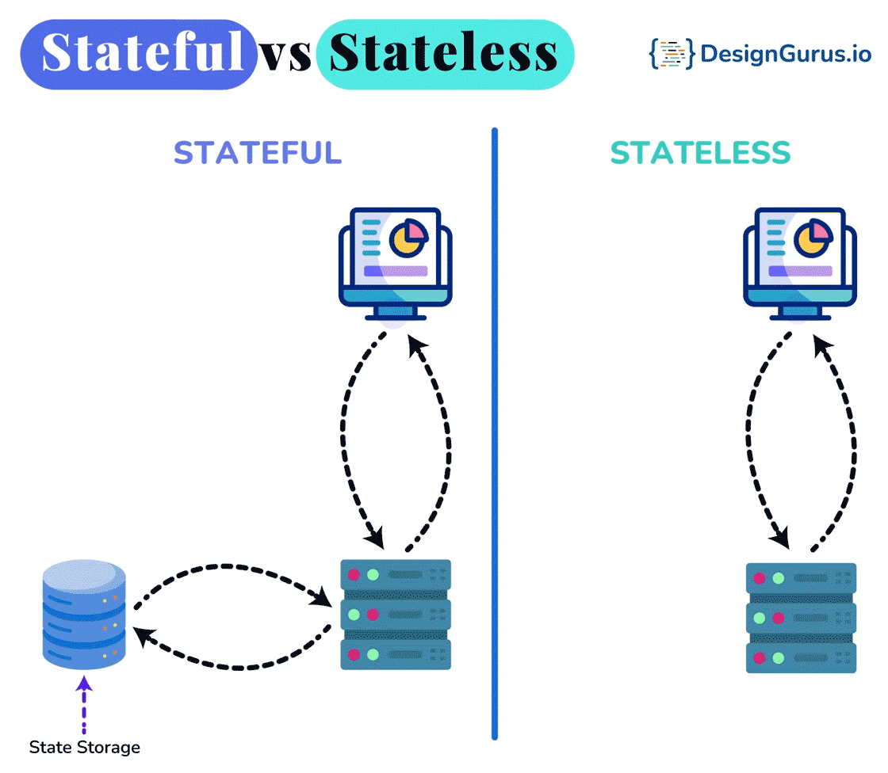

# TODO
Below topics were not finished, Plz finish it by search the Name online.

# Resources
https://github.com/karanpratapsingh/system-design

## CDN
### Origin Server vs.Edge Server
### CDN Architecture
https://www.designgurus.io/blog/content-delivery-network-cdn-system-design-basics
### Push CDN vs. Pull CDN

## Data Partitioning
https://www.geeksforgeeks.org/data-partitioning-techniques/
### Partitioning Methods
### Data

## Proxy Server
### VPN vs. Proxy Server

## Redundancy and Replication
https://www.geeksforgeeks.org/redundancy-system-design/
### Redundancy vs. Replication
### Data Backup vs. Disaster Recovery

## CAP Theorems and PACELC Theorems

## Database (SQL vs. NoSQL)
Chapter II of https://github.com/karanpratapsingh/system-design 

## Indexing 
https://www.geeksforgeeks.org/indexing-in-system-design/

## Bloom Filters
https://www.geeksforgeeks.org/bloom-filters-in-system-design/

## Difference Between Long-Polling, WebSockets, and Server-Sent Events
https://medium.com/geekculture/ajax-polling-vs-long-polling-vs-websockets-vs-server-sent-events-e0d65033c9ba

## Quorum
https://www.geeksforgeeks.org/quorum-in-system-design/

## Heartbeat
https://www.designgurus.io/answers/detail/what-are-heartbeat-messages-in-distributed-systems

## Checksum

## Leader and Follower
https://martinfowler.com/articles/patterns-of-distributed-systems/leader-follower.html

## Security
https://www.geeksforgeeks.org/essential-security-measures-in-system-design/
### DDOS

## Distributed Messaging System
https://www.geeksforgeeks.org/distributed-messaging-system-system-design/ 
### RabbitMQ vs. Kafka vs. ActiveMQ
https://www.designgurus.io/blog/rabbitmq-kafka-activemq-system-design

## Architecture of a Distributed File System
https://www.geeksforgeeks.org/what-is-dfsdistributed-file-system/

## Misc
### Batch Processing vs. Stream Processing
https://www.geeksforgeeks.org/difference-between-batch-processing-and-stream-processing/
### XML vs. JSON
### Synchronous vs. Asynchronous Communication
https://www.geeksforgeeks.org/difference-between-synchronous-and-asynchronous-transmission/
### Push vs. Pull Notification Systems
https://stackoverflow.com/questions/12367557/difference-between-push-notification-and-pull-notification
### Microservices vs. Serverless Architecture
### Message Queues vs. Service Bus
https://stackoverflow.com/questions/7793927/message-queue-vs-message-bus-what-are-the-differences
### Stateful vs. Stateless Architecture
  
https://www.geeksforgeeks.org/stateful-vs-stateless-architecture/
### Event-Driven vs. Polling Architecture

# Quiz
## Which of the following scenarios is better suited for a SQL database?
- A social media application with diverse and unpredictable user-generated content.
- A banking application requiring transactional consistency.
- A large-scale IoT application requiring high write throughput.
- A real-time analytics application with high volume and velocity of data.
ANS: 2

## Which type of database is more suitable for a scenario requiring horizontal scalability?
- SQL
- NoSQL
- Both SQL and NoSQL
- Neither SQL nor NoSQL
ANS: 2

## For an application that requires complex query and aggregation operations, which type of database is more appropriate?
- SQL
- NoSQL
- Both SQL and NoSQL
- Neither SQL nor NoSQL
ANS: 1

## What is the primary purpose of the Domain Name System (DNS)?
- Encrypting web traffic
- Compressing web content
- Translating domain names to IP addresses
- Routing email messages
ANS: 3  
The primary purpose of DNS is to translate human-readable domain names into machine-readable IP addresses, allowing users to access websites and online services using memorable domain names instead of having to memorize numerical IP addresses.

## Which DNS server holds the actual DNS records for a domain?
- Root server
- TLD server
- Authoritative name server
- DNS resolver
ANS: 3  
Authoritative name servers hold the actual DNS records for a domain, including its IP address and other information. They provide the final answer to DNS queries, enabling users to access the desired website or resource.

## What is the Time To Live (TTL) in a DNS record?
- The time a DNS record is stored in the cache before being removed
- The time it takes for a DNS query to reach the server
- The time it takes for a DNS server to process a query
- The time it takes for a DNS query to travel across the internet
ANS: 1  
Time To Live (TTL) is a value associated with a DNS record, specifying how long the record should be stored in the cache. TTL is measured in seconds, and once the TTL expires, the cached information is removed to ensure that outdated information is not used.

## Which technique allows multiple servers to share the same IP address and routes users to the nearest server based on network latency and server availability?
- Round-robin DNS
- Geographically distributed DNS servers
- Content Delivery Networks (CDNs)
- Anycast routing
ANS: 4
Anycast routing is a networking technique that allows multiple servers to share the same IP address. It routes users' queries to the nearest server based on factors like network latency and server availability, providing load balancing, reduced latency, and high availability for DNS services.

## What is the primary purpose of caching in computer systems?
- To encrypt data
- To store data temporarily for faster access
- To permanently store data
- To compress data
ANS: 2  
The primary purpose of caching is to store data temporarily for faster access. By caching frequently accessed data, systems can reduce the need to repeatedly fetch the same information from the original source, thereby improving performance and reducing resource usage.

## Which of the following is NOT a common type of cache?
- CPU cache
- Browser cache
- Disk cache
- Time cache
ANS: 4  
Time cache is not a common type of cache. Common types of cache include CPU cache (used by processors to store frequently accessed data), browser cache (used by web browsers to store web content), and disk cache (used by storage devices to temporarily store data for faster access).

## What is the primary downside of caching?
- Increased security risk
- Increased storage space requirements
- The potential for serving outdated or stale data
- Slower access to data
ANS: 3
The primary downside of caching is the potential for serving outdated or stale data. Since cached data is a copy of the original data, any changes made to the original data may not be reflected in the cache immediately. This can result in users accessing outdated information until the cache is updated or the cached data expires.

## Which cache replacement policy removes the item that has not been accessed for the longest time?
- Least Recently Used (LRU)
- First In, First Out (FIFO)
- Most Recently Used (MRU)
- Random Replacement (RR)
ANS: 1
The Least Recently Used (LRU) cache replacement policy removes the item that has not been accessed for the longest time. This policy aims to keep frequently accessed data in the cache while evicting less frequently used data to make room for new items.

## What is a Content Delivery Network (CDN) cache primarily used for?
- Storing data on the user's local device
- Reducing the load on the main server by distributing content across multiple servers
- Storing frequently accessed files on a single server
- Encrypting data before it is sent across the internet
ANS: 2
A Content Delivery Network (CDN) cache is primarily used to reduce the load on the main server by distributing content across multiple servers. CDNs store copies of web content on geographically distributed servers, allowing users to access the content from a server that is closer to them, resulting in faster load times and improved performance.

## In caching, what does "cache hit" mean?
- The process of loading data into the cache
- An error that occurs when the cache is full
- When the requested data is found in the cache
- When the requested data is not found in the cache
ANS: 3
A "cache hit" occurs when the requested data is found in the cache. This means that the system can quickly access the data without having to fetch it from the original source, resulting in faster performance and reduced resource usage.

## Which of the following is NOT a benefit provided by proxy servers?
- Accelerating web page loading times through caching
- Improving network security by filtering malicious content
- Bypassing network restrictions or geolocation-based content blocking
- Increasing storage capacity on client devices
ANS: 4
Proxy servers do not increase storage capacity on client devices. Their main benefits include caching, improving network security, load balancing, and bypassing network restrictions or geolocation-based content blocking.

## Which type of proxy is commonly used to provide anonymity and protect users' privacy?
- Transparent proxy
- Reverse proxy
- Forward proxy
- Caching proxy
ANS: 3
Forward proxies, also known as regular proxies or just proxies, are commonly used to provide anonymity and protect users' privacy. By routing client requests through a forward proxy, the destination server sees the proxy's IP address instead of the user's, helping to mask the user's identity and maintain privacy.

## In horizontal partitioning, how is data typically divided among nodes?
- By rows
- By columns
- By tables
- By databases
ANS: 1
In horizontal partitioning, also known as sharding, data is typically divided among nodes by rows. Each node is responsible for a specific range or subset of the data, which can help distribute load and improve performance.

## What is the main advantage of vertical partitioning?
- It reduces the size of the data stored on each node
- It improves query performance by storing related columns together
- It distributes load evenly across all nodes in the system
- It encrypts data before storing it
ANS: 2
The main advantage of vertical partitioning is that it improves query performance by storing related columns together on the same node. This approach can help reduce the amount of data that needs to be transferred between nodes when executing queries, leading to faster query execution times.

## Which of the following is a characteristic of Bloom filters?
- They provide a definitive answer for set membership
- They can produce false positives
- They produce false negatives
- They require a large amount of memory
ANS: 2
Bloom filters can produce false positives, which means they might indicate that an element is a member of a set when it is not. However, they do not produce false negatives, meaning if the filter indicates an element is not in the set, it is guaranteed not to be.

## In a Bloom filter, what is the purpose of using multiple hash functions?
- To compress data
- To reduce the likelihood of false positives
- To increase the likelihood of false positives
- To encrypt data
ANS: 2
In a Bloom filter, multiple hash functions are used to reduce the likelihood of false positives. By using different hash functions, the filter can distribute the set membership information more evenly across the bit array, making it less likely that two different elements will produce the same set of hash values.

## Which of the following is an advantage of using a distributed messaging queue in a system?
- Reduced latency for all operations
- Guaranteed message delivery in all cases
- Improved fault tolerance and system resilience
- Total elimination of data loss
ANS: 3
Using a distributed messaging queue in a system can improve fault tolerance and system resilience. It allows components to send and receive messages without being directly connected, which means that if one component fails, the others can still continue to operate. Additionally, messaging queues can often buffer messages, ensuring that they are not lost if a component is temporarily unavailable.
